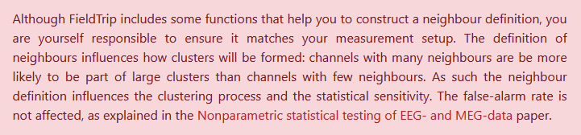
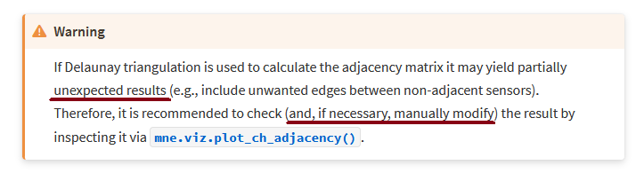
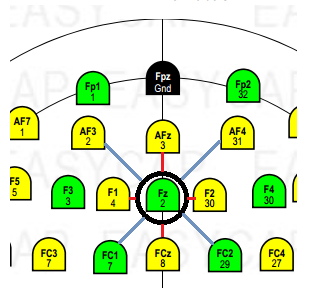
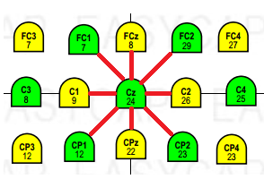

# Do you really know your neighbourhood
So, I came across this warning in Fieldtrip toolbox website

## The context
- Whenever we use spatially spanning cluster-level statistics, it is very important for the algorithm to know what electrodes are near each other
- Each cap maker has their own way of putting up where electrodes are in space (X, Y, and Z values)
- Somewhere in the study, we choose neighbours for each electrode, either on purpose or by default (mostly by default)
- You may lookup the [ft_prepare_neighbours](http://web.mit.edu/spm_v12/distrib/spm12/external/fieldtrip/ft_prepare_neighbours.m) function to know in depth about common methods (distance, triangulation, template) in this domain
- BY the way, mne uses `Delaunay triangulation` for this and I opened my mouth widely on seeing the warning in mne's documentation page

## If you're also shocked by these crazy little details or thinking what the hell I'm talking about, you might find it helpful to read one of my old [Readme](https://github.com/rahulvenugopal/Learn_NeuralDecoding_for_EEG#motivation-for-tfce)

## Let's take a step back and examine the issue from its foundation
Take a look at the 64 channel montage from easy cap for actiChamp plus amplifier from brainproducts

- Take `Fz` electrode, who are its neighbours?

Option A: F1, F2
Option B: F1, F2, AFz, FCz
Option C: F1, F2, AFz, FCz, AF3, AF4, FC1, FC2

- Establishing a neighborhood boundary is tricky (now I know the logic of territory wars). Where does `us` end and `them` begin if you want to think like Sapolsky. Eh, I've gotten off track. Now, think about `Cz`. If you are one of those who thought I was being generous with option C in the previous example, booom!

> Hope I have convinced you about Knowing Thy Neighbours. Amen

## By the way, you will find a small matlab script which will objectively tell you who are your neighbours based on a simple distance measure calculated from your own cap manufacturer's locations (I mean X, Y, Z locations) in this repo
