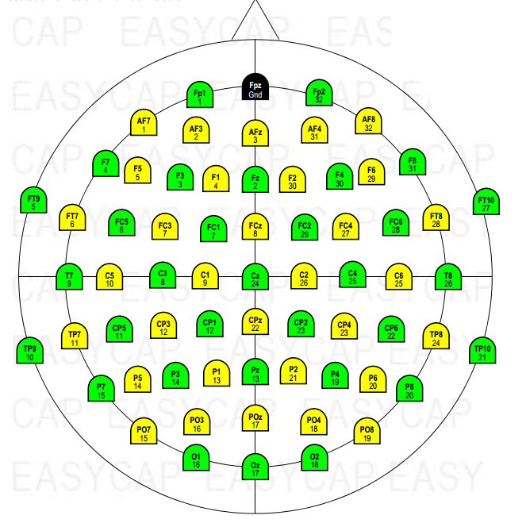

# Do you really know your neighbourhood
So, I came across this warning in Fieldtrip toolbox website

## The context
- Whenever we use spatially spanning cluster-level statistics, it is very important for the algorithm to know what electrodes are near each other
- Each cap maker has their own way of putting up where electrodes are in space (X, Y, and Z values)
- Somewhere in the study, we choose neighbours for each electrode, either on purpose or by default (mostly by default)
- You may lookup the [ft_prepare_neighbours](http://web.mit.edu/spm_v12/distrib/spm12/external/fieldtrip/ft_prepare_neighbours.m) function to know in depth about common methods (distance, triangulation, template) in this domain
- BY the way, mne uses `Delaunay triangulation` for this and I opened my mouth widely on seeing the warning in mne's documentation page

## If you're also shocked by these crazy little details or thinking what the hell I'm talking about, you might find it helpful to read one of my old [Readme](https://github.com/rahulvenugopal/Learn_NeuralDecoding_for_EEG#motivation-for-tfce)

## Let's take a step back and examine the issue from its foundation

